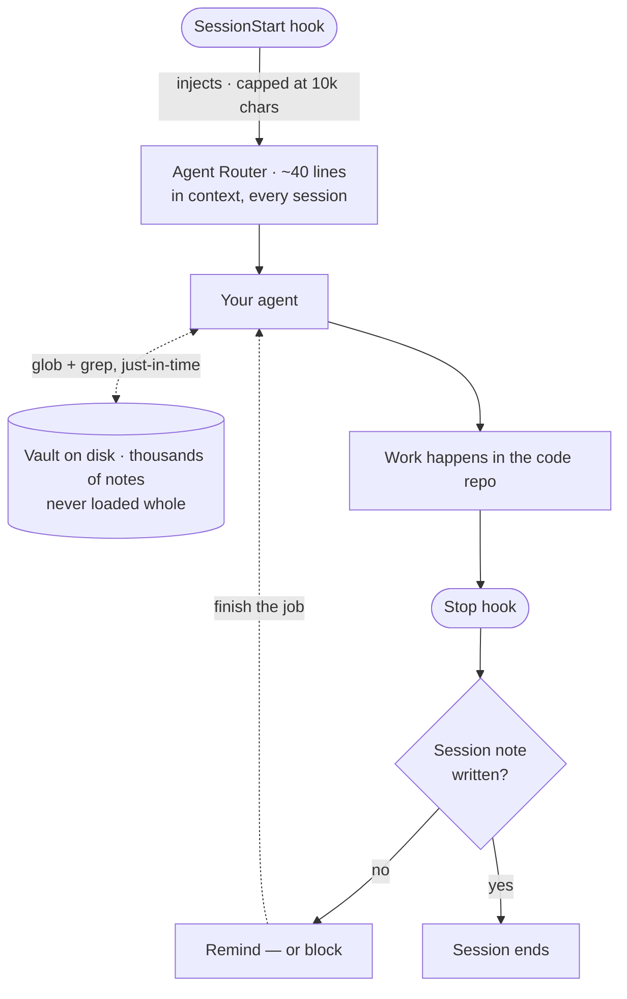
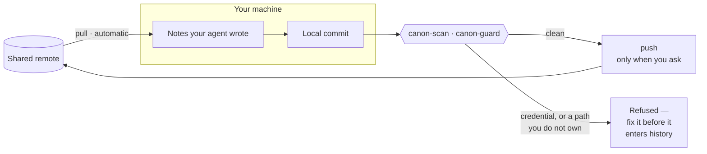

# canon

**A shared knowledge vault your whole team's AI agents read from and write back to.**

Plain markdown in git. Your agents get the team's accumulated decisions, project
state, and domain knowledge as context — automatically, in every repo — and they
add to it as work happens. Knowledge compounds instead of living in one person's
head and one person's chat history.

*A canon is the agreed body of knowledge a group works from. That's the idea:
one shared, versioned, reviewable canon instead of fifteen private ones.*

> Prefer your own naming? Everything is one substitution away:
> `grep -rl canon . | xargs perl -pi -e 's/canon/yourname/g; s/CANON/YOURNAME/g'`
> then rename the `bin/canon-*` files. (`perl -pi` rather than `sed -i`, which
> needs different arguments on BSD and GNU.)

## How it works

A small map goes into the agent's context every session. The vault itself stays
on disk and gets searched on demand — it is far larger than any context window,
so loading it is not an option and is not the point.



Sharing is asymmetric on purpose. Reading is safe to automate; publishing is
irreversible, so it stays deliberate and passes a gate first.



## What you get

| Piece | What it does |
|---|---|
| **A vault** | Markdown notes: `Decisions/`, `Projects/`, `Sessions/`, `Reference/`, … in one git repo |
| **A router note** | The one small file agents load every session — a map of what lives where |
| **Repo wiring** | `CLAUDE.md` + `SessionStart` hook so agents find the vault from any repo |
| **A session-note check** | A `Stop` hook that notices when work happened but nothing got written down |
| **Path-scoped rules** | Write conventions that load only when an agent touches vault files |
| **`canon-sync`** | Pull, scan, commit, and — only when you ask — push |
| **`canon-scan`** | Blocks credentials and obvious identifiers from entering git history |
| **`canon-guard`** | Warns when a commit touches a note somebody else owns |

## Quickstart (5 minutes)

```bash
git clone <this-repo> canon-kit && cd canon-kit

# 1. Create the vault (or point at an existing folder of notes)
./bin/canon-init-vault ~/team-vault

# 2. Tell this machine where it lives
mkdir -p ~/.config/canon && echo "$HOME/team-vault" > ~/.config/canon/path

# 3. Wire up a repo — safe on repos that already have a CLAUDE.md
./install.sh /path/to/your/repo

# 4. Put the secret gate in front of every commit to the vault
./bin/canon-install-vault-hooks ~/team-vault

# 5. Confirm
/path/to/your/repo/.claude/hooks/canon-path     # prints the vault path
./bin/canon-sync --status                       # what would sync, changes nothing
```

Then open a Claude Code session in that repo and ask *"what does the team
knowledge vault say about how we work?"* If the wiring is live, it answers from
the router note without being told where to look.

Commit `.claude/` and `CLAUDE.md` so teammates inherit the setup by cloning.
Each teammate only does step 2.

## How it finds the vault

Nothing hardcodes a path. `canon-path` resolves, first hit wins:

1. `$CANON_HOME`
2. `<repo>/.canon` — a marker file containing the path (commit this to pin a
   convention for the team)
3. `~/.config/canon/path`
4. `~/canon`

An explicitly-set `$CANON_HOME` that points nowhere **fails loudly instead of
falling back** — silently loading a different vault than you asked for is worse
than loading none.

## Design, and why

**The vault is reached on demand, never inlined.** `CLAUDE.md` loads in full on
every request, `@`-imports don't reduce context, and hook-injected context is
capped at 10,000 characters. So the only thing that enters context is a short
router note; the agent then globs and greps the vault for what it actually
needs. That's also how Claude Code's own retrieval is designed — filesystem
search just-in-time, not a vector database.

**Size budgets are load-bearing.** Index notes ≤200 lines / 25 KB, detail notes
under 500 lines, references one level deep, TOC over 100 lines. Agents retrieve
by filename and structure long before they read content, so naming and shape are
infrastructure, not style.

**Layered defaults, because nothing guarantees "always."** `CLAUDE.md` and rules
are additive and reconciled by model judgment; hooks fire on their event but can
be skipped by an unaccepted trust dialog, are scoped per project, and can be
disabled by enterprise policy. Redundancy is the design. Pair every preventer
with a detector — the `Stop` hook exists precisely because the end-of-session
write is the step that gets skipped.

## Sync: automatic inbound, deliberate outbound

Sharing a vault fails in a specific way: everyone writes locally, nobody commits,
and the "shared" vault quietly becomes a set of private ones. So sync is
automated — but asymmetrically, because the three steps carry very different
risk.

| Step | Default | Why |
|---|---|---|
| **Pull** | automatic (`CANON_AUTOPULL=1`) | Pure upside. You read fresh context; nothing leaves your machine. |
| **Commit** | local, opt-in (`CANON_AUTOCOMMIT=1`) | Real history and diffs, still nothing leaves your machine. |
| **Push** | **never automatic** | The irreversible step. Once a note is on a remote it may be cached or indexed even after you delete it. |

```bash
canon-sync              # pull, scan, commit locally
canon-sync --push       # ...and push, only if the scan passed
canon-sync --status     # what would happen, changes nothing
```

If your team isn't handling regulated or sensitive data, this asymmetry is
probably more caution than you need — install a git plugin, auto-sync every ten
minutes, move on. The gate below is what buys you the right to automate more.

## The gate

`canon-scan` inspects **only the lines being added** in a staged commit, so
existing content isn't re-flagged forever. It runs `gitleaks` when present and
always also applies its own high-precision patterns, so it works on a machine
with nothing installed.

`canon-install-vault-hooks` puts it in the vault's `pre-commit`, which means
**it fires on plain `git commit` too** — not only through `canon-sync`. Verified:
a planted API key blocks both paths, and an auto-commit that trips the gate
reports itself instead of failing silently.

Two limits, stated plainly:

- **`.git/hooks` is not shared by cloning.** Each teammate runs
  `canon-install-vault-hooks` once. Your git host's own push protection is the
  only gate nobody can skip — turn it on.
- **Some editor sync plugins bypass git hooks entirely** (Obsidian Git uses
  isomorphic-git, which does not execute them). If you depend on the gate, make
  `canon-sync` the commit path for the vault.

**Measured false-positive burden.** Run over a real 2,040-file vault: 28 flagged
lines, *all* of them inside a vendored third-party documentation mirror
containing synthetic HL7 examples and sample JWTs. **Zero** false positives
across ~240 human- and agent-authored notes. Exclude a vendored doc tree with
a line in the committed `.canon-scan-exclude` rather than loosening the patterns —
committed, so the exclusion applies to the whole team instead of one shell.

And the honest ceiling: this catches **credentials** well and **personal or
health information written as ordinary prose** poorly. A regex cannot recognise a
clinical anecdote. Convention and human review remain the real controls.

## Ownership: not everything should be everyone's

`Vision/` is direction from leadership; session notes are everyone's. Both live in
one vault, so ownership is layered:

1. **Rules + router** tell agents `Vision/` is owned — catches the likeliest
   failure, which is an agent tidying a vision doc because tidying is what agents do.
2. **`.canon-owners`** maps globs to owners; `canon-guard` warns (or blocks) at
   commit time and says what to do instead. A seatbelt, not a lock.
3. **`CODEOWNERS` + branch protection** is the only layer that actually enforces —
   it runs on the server and `--no-verify` can't touch it.

And the hard boundary: git cannot restrict *reading*. Write governance fits in one
repo; if someone must not read something, that needs a second repo.

**Read [`docs/MULTIPLAYER.md`](docs/MULTIPLAYER.md)** for the full model — the four
classes of file, where conflicts actually occur, and how to choose a write model
without accidentally requiring a PR per session note.

## Configuration

| Variable | Default | Effect |
|---|---|---|
| `CANON_HOME` | — | Vault path override; wins over everything |
| `CANON_AUTOPULL` | `0` | `1` = `git pull --rebase --autostash` the vault at session start |
| `CANON_ENFORCE_SESSION_NOTE` | `remind` | `block` = tell Claude to finish; `off` = disable |
| `CANON_SESSION_NOTE_WINDOW_MIN` | `720` | How recent a session note counts as "written" |
| `CANON_AUTOCOMMIT` | `0` | `1` = commit vault changes locally at session end (never pushes) |
| `CANON_ROUTER` | `Vision/Agent Router.md` | Which note gets injected |
| `CANON_SESSIONS_DIR` | `Sessions` | Where session notes live |
| `CANON_SCAN_EXCLUDE` | — | Colon-separated regexes of paths the scanner skips (per-machine; prefer the committed `.canon-scan-exclude`) |
| `CANON_GUARD` | `warn` | `block` = refuse commits to paths you don't own; `off` = disable |
| `CANON_SKIP_SCAN` | `0` | `1` = bypass the gate. Be sure. |

Auto-pull is **off by default**: a hook that mutates a git repo you didn't ask
it to touch is a bad default, and a half-rebased vault is worse than a stale one.

## Before you roll this out to a team

- **Make the vault repo private**, and decide read/write access deliberately.
- **Nothing with personal data, secrets, or credentials goes in.** Git history is
  permanent. Run `canon-install-vault-hooks` before the first push, and turn on
  your host's push protection. Note that path-based `permissions.deny` rules
  cannot see content — they will not catch an identifier written into prose, and
  neither will the scanner if it is phrased as a sentence.
- **If you're in a regulated industry, get the compliance question answered
  first** — where this data may live, and under what agreement with your git
  host. Do this before the vault has a hundred notes in it, not after.
- **Pin a Claude Code version** and run `docs/VERIFY.md` against it. The hook and
  skill surface changes frequently; version-stale config that silently does
  nothing is the most common failure.

## What this is not

Not an agent-memory product, not a vector store, not a server. It is a set of
conventions plus the smallest amount of wiring that makes them fire
automatically. It composes with markdown-native memory tools rather than
competing with them — they own storage and retrieval; this owns the *practice*.

## Requirements

`bash`, `git`, `python3`. No package installs, no daemons, no network calls.

## Status

Tested end to end: fresh repo; repo with a pre-existing `CLAUDE.md` and
`settings.json` (both preserved, merged not clobbered); repeat installs (no
duplication); unconfigured and misconfigured vaults; the `Stop` hook across
seven states; the gate blocking five secret formats via both `canon-sync` and
plain `git commit`; auto-commit off, on, and blocked-by-gate.

Two known unknowns, deliberately not papered over:

1. **`Stop`-hook `block` mode's output shape** is the one thing not confirmed
   against a known-good working example. That is why it defaults to non-blocking
   `remind`. `docs/VERIFY.md` step 5 tells you how to confirm it on your version.
2. **Prose-level personal-data detection** is weak by nature, and the compliance
   question — where this data may live, under what agreement with your git host —
   is yours to answer, not this kit's.

Requires `bash`, `git`, `python3`. No package installs, no daemons, no network
calls.
