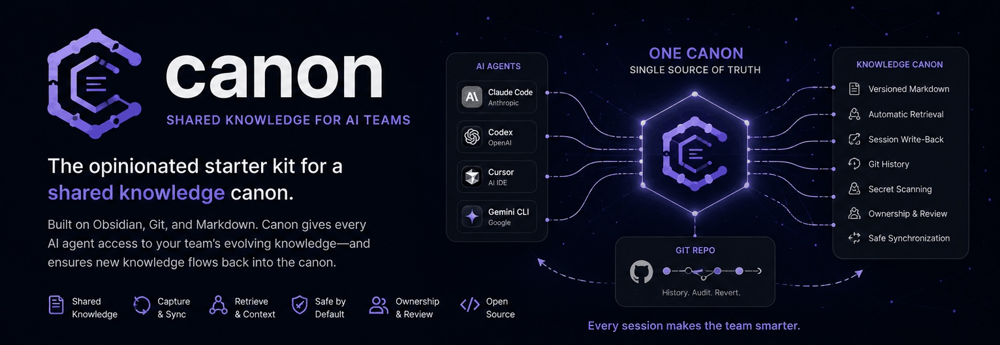
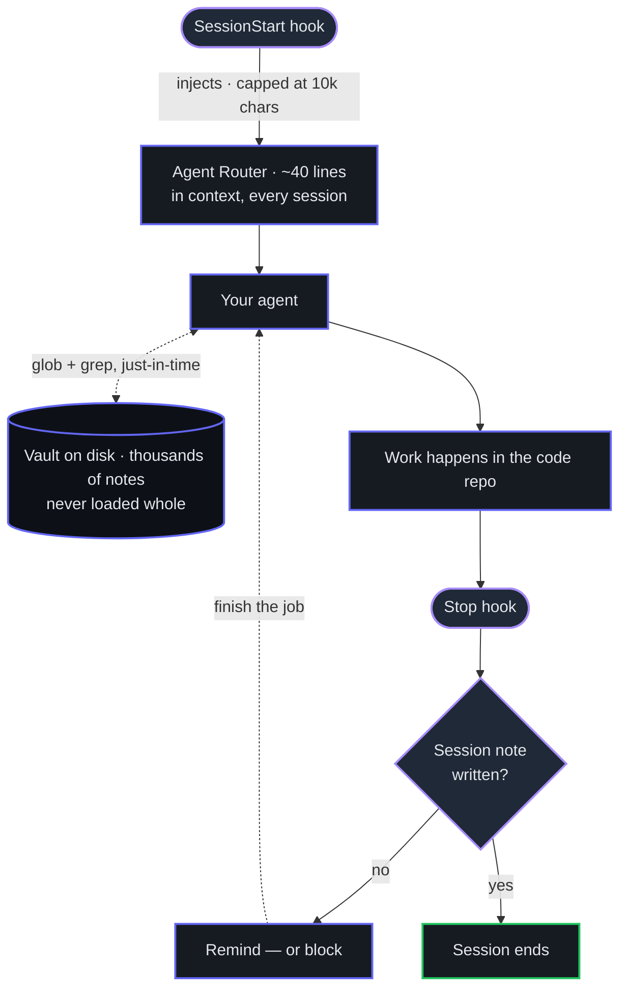
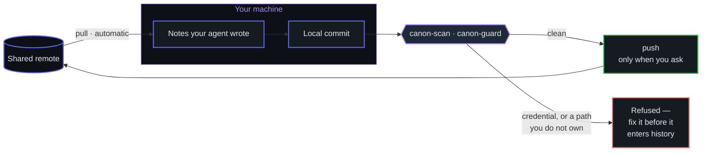

<p align="center">
  
</p>

<p align="center">
  <a href="https://github.com/Chris-Carruthers/canon/actions/workflows/ci.yml"></a>
  
  
  
</p>

<h3 align="center">The opinionated starter kit for a shared knowledge canon.</h3>

<p align="center">
  Built on Obsidian, Git, and Markdown. Your team's AI agents read the same
  accumulated knowledge — and write what they learn back into it.<br>
  <em>Every session makes the team smarter.</em>
</p>

---

## New here? Read this first

*No terminal required to understand it. Skip to [Quickstart](#quickstart) if you just want to install it.*

### The one-sentence version

A folder of notes on your computer that both you and your AI assistant read and
write, shared with your team — so what everyone learns accumulates instead of
living in one person's head and one person's chat history.

### What it puts on your computer

**1. A notes folder.** Ordinary text files, organised by kind: what you decided
and why, what each project is and where it stands, background on customers or
domains, and a dated log of every work session.

**2. Your code folders, untouched.** Code never goes in the notes. Notes point at
code by location instead — *"the bug was in `auth.ts`, line 42."*

**3. A standing instruction for your AI assistant.** A small config file telling
it: *before real work, read the notes; after real work, write down what happened.*
It applies everywhere you work, so you don't have to remember to ask.

A useful way to picture it: the notes folder is the **team's shared notebook**.
Everyone keeps a copy on their own desk, and a master copy lives online that the
copies get matched against. Nobody edits a live document at the same time as
anybody else — you change your copy, then send it up.

### What happens in a normal work session

1. You ask your assistant for something.
2. It reads the notes first — the project's page, the last session's log — so it
   starts with context instead of asking you to re-explain.
3. You do the work.
4. At the end it writes a dated note: what changed, what was decided, what's still
   open, linked to the project.

Next week, *"why did we do it that way?"* has an answer with a date on it. In six
months, when the person who decided it is on holiday, their reasoning is still there.

### What you actually do

| You want to… | You do this |
|---|---|
| Read or explore the notes | Open the folder in **Obsidian**. `Cmd+O` jumps to any note by name. |
| Add a document — a PDF, a deck, a transcript | Drop it in the `Sources` folder and run `/ingest`. Your assistant reads it and files the useful parts into the right notes. |
| Find where something stands | Open the project's note, then the newest session log linked from it. |
| Tidy up after a busy week | Run `/lint-vault`. It reports broken links, stale notes and contradictions, and offers to fix them. |
| Share your notes with the team | One command that checks them and sends them up. |

**You rarely write the notes by hand.** You drop things in, ask questions, and the
notes get maintained as a side effect of the work.

### Automatic, versus your decision

| Step | Who |
|---|---|
| Reading the notes at the start | **Automatic** |
| Writing the session note at the end | **Automatic**, with a nudge if it gets skipped |
| Getting teammates' updates | **Automatic** — and only ever a safe update; it will not overwrite something you are mid-edit on |
| **Publishing your notes to the team** | **You decide.** Never automatic. |

That last line is deliberate. Once something is published it is effectively
permanent, so a person looks first. Reading is safe to automate; publishing isn't.

### The safety net, and its limit

Before anything is saved, an automatic check looks for passwords, API keys and
things shaped like personal identifiers, and **refuses the save** if it finds any.

It is honest about what it cannot do. It is good at spotting *credentials* — text
with a recognisable shape. It is poor at spotting **personal or confidential
information written as ordinary prose**, because a pattern-matcher cannot
recognise a story about a named individual. So the rule stands on its own: **don't
put sensitive personal information in the notes.** The check is a backstop, not
permission.

### How a teammate joins

1. Install Obsidian — free, including for work use.
2. Copy the notes folder down — one command, once.
3. Tell their machine where it lives — one line, once.

Then they can read everything the team knows, and so can their AI assistant.

### Which assistants this works with

The notes are plain Markdown, so **any** tool that can read files can use them —
Claude Code, Codex, Cursor, Gemini CLI, or a person with `grep`.

The *automatic* wiring in this kit — the part that loads context at the start of a
session and writes the note at the end — currently ships for **Claude Code only**.
Adding other runtimes is a small job and an explicitly welcome contribution; see
[CONTRIBUTING](CONTRIBUTING.md). Nothing about the notes themselves is
Claude-specific.

---

## How it works

A small map goes into the agent's context every session. The vault itself stays on
disk and gets searched on demand — it is far larger than any context window, so
loading it is not an option and is not the point.



Sharing is asymmetric on purpose. Reading is safe to automate; publishing is
irreversible, so it stays deliberate and passes a gate first.



## What you get

| Piece | What it does |
|---|---|
| **A vault** | Markdown notes: `Decisions/`, `Projects/`, `Sessions/`, `Reference/`, … in one git repo |
| **A router note** | The one small file agents load every session — a map of what lives where |
| **Repo wiring** | `CLAUDE.md` + `SessionStart` hook so agents find the vault from any repo |
| **A session-note check** | A `Stop` hook that notices when work happened but nothing got written down |
| **Path-scoped rules** | Write conventions that load only when an agent touches vault files |
| **`canon-sync`** | Pull, scan, commit, and — only when you ask — push |
| **`canon-scan`** | Blocks credentials and obvious identifiers from entering git history |
| **`canon-guard`** | Warns when a commit touches a note somebody else owns |

## Quickstart (5 minutes)

```bash
git clone <this-repo> canon-kit && cd canon-kit

# 1. Create the vault (or point at an existing folder of notes)
./bin/canon-init-vault ~/team-vault

# 2. Tell this machine where it lives
mkdir -p ~/.config/canon && echo "$HOME/team-vault" > ~/.config/canon/path

# 3. Wire up a repo — safe on repos that already have a CLAUDE.md
./install.sh /path/to/your/repo

# 4. Put the secret gate in front of every commit to the vault
./bin/canon-install-vault-hooks ~/team-vault

# 5. Confirm
/path/to/your/repo/.claude/hooks/canon-path     # prints the vault path
./bin/canon-sync --status                       # what would sync, changes nothing
```

Then open a Claude Code session in that repo and ask *"what does the team
knowledge vault say about how we work?"* If the wiring is live, it answers from
the router note without being told where to look.

Commit `.claude/` and `CLAUDE.md` so teammates inherit the setup by cloning.
Each teammate only does step 2.

## How it finds the vault

Nothing hardcodes a path. `canon-path` resolves, first hit wins:

1. `$CANON_HOME`
2. `<repo>/.canon` — a marker file containing the path (commit this to pin a
   convention for the team)
3. `~/.config/canon/path`
4. `~/canon`

An explicitly-set `$CANON_HOME` that points nowhere **fails loudly instead of
falling back** — silently loading a different vault than you asked for is worse
than loading none.

## Reading it as a human — Obsidian, optional but recommended

The vault is plain markdown, so any editor works and `grep` works. Your agents
never touch Obsidian; they read files. But humans navigate knowledge by following
links, and that's what [Obsidian](https://obsidian.md) adds for free:

- **`Cmd+O`** to jump to any note by name — the fastest thing in it
- **Backlinks** — "what else references this?", which is how you find context you
  didn't know to ask for
- **Graph view** — see the shape of what the team knows
- **Bases** — auto-generated tables from frontmatter, so index notes stop being
  hand-maintained (and stop being a merge-conflict surface)

It's [free for commercial use](https://obsidian.md/license) — the paid Commercial
License is optional support, not a requirement. Point it at the vault folder with
*Open folder as vault*.

**What you lose without it:** `[[wikilinks]]` render as literal text elsewhere, so
you get a searchable folder rather than a connected one. Everything is still
readable. Nothing breaks.

`canon-init-vault` writes a `.gitignore` that commits shared editor settings while
excluding per-person UI state, so nobody fights over pane layouts.

### Two rules if you use the Obsidian Git plugin

1. **Don't run its timer alongside `CANON_AUTOPULL`.** Two processes pulling on
   independent schedules is how you manufacture a race with the editor's own
   autosave. Prefer the session-start pull: a timer fires mid-sentence, session
   start doesn't.
2. **Keep mobile read-only.** The plugin uses `simple-git` — the real git binary —
   on desktop, so its commits *do* run your hooks and the gate holds. On mobile it
   falls back to `isomorphic-git`, which does **not** run hooks, so mobile writes
   are ungated. Mobile also has no SSH auth and hard repo-size limits. Read on a
   phone by browsing the repo on your git host instead.

## Design, and why

**The vault is reached on demand, never inlined.** `CLAUDE.md` loads in full on
every request, `@`-imports don't reduce context, and hook-injected context is
capped at 10,000 characters. So the only thing that enters context is a short
router note; the agent then globs and greps the vault for what it actually
needs. That's also how Claude Code's own retrieval is designed — filesystem
search just-in-time, not a vector database.

**Size budgets are load-bearing.** Index notes ≤200 lines / 25 KB, detail notes
under 500 lines, references one level deep, TOC over 100 lines. Agents retrieve
by filename and structure long before they read content, so naming and shape are
infrastructure, not style.

**Layered defaults, because nothing guarantees "always."** `CLAUDE.md` and rules
are additive and reconciled by model judgment; hooks fire on their event but can
be skipped by an unaccepted trust dialog, are scoped per project, and can be
disabled by enterprise policy. Redundancy is the design. Pair every preventer
with a detector — the `Stop` hook exists precisely because the end-of-session
write is the step that gets skipped.

## Sync: automatic inbound, deliberate outbound

Sharing a vault fails in a specific way: everyone writes locally, nobody commits,
and the "shared" vault quietly becomes a set of private ones. So sync is
automated — but asymmetrically, because the three steps carry very different
risk.

| Step | Default | Why |
|---|---|---|
| **Pull** | automatic (`CANON_AUTOPULL=1`) | Pure upside. `--ff-only`, so it cannot rewrite history or strand a rebase under an open editor. |
| **Commit** | local, opt-in (`CANON_AUTOCOMMIT=1`) | Real history and diffs, still nothing leaves your machine. |
| **Push** | **never automatic** | The irreversible step. Once a note is on a remote it may be cached or indexed even after you delete it. |

```bash
canon-sync              # pull, scan, commit locally
canon-sync --push       # ...and push, only if the scan passed
canon-sync --status     # what would happen, changes nothing
```

If your team isn't handling regulated or sensitive data, this asymmetry is
probably more caution than you need — install a git plugin, auto-sync every ten
minutes, move on. The gate below is what buys you the right to automate more.

## The gate

`canon-scan` inspects **only the lines being added** in a staged commit, so
existing content isn't re-flagged forever. It runs `gitleaks` when present and
always also applies its own high-precision patterns, so it works on a machine
with nothing installed.

`canon-install-vault-hooks` puts it in the vault's `pre-commit`, which means
**it fires on plain `git commit` too** — not only through `canon-sync`. Verified:
a planted API key blocks both paths, and an auto-commit that trips the gate
reports itself instead of failing silently.

Two limits, stated plainly:

- **`.git/hooks` is not shared by cloning.** Each teammate runs
  `canon-install-vault-hooks` once. Your git host's own push protection is the
  only gate nobody can skip — turn it on.
- **If `core.hooksPath` is set** (husky, the pre-commit framework, a shared team
  hooks dir) git ignores `.git/hooks` entirely. The installer detects this and
  installs into the real directory, because a gate in a directory git never reads
  is worse than no gate — you believe you are covered. It tells you when it does.
- **Editor sync plugins are fine on desktop, and a hole on mobile.** Obsidian Git
  ships two backends: `simple-git` (which spawns the real `git` binary) on
  desktop, and `isomorphic-git` on mobile, because a plugin cannot use a native
  git install on Android or iOS. So on **desktop the plugin's commits do run your
  hooks** and the gate holds; on **mobile they do not**, and mobile also has no
  SSH auth and hard repo-size limits. Treat mobile as read-only for a gated
  vault.

**Measured false-positive burden.** Run over a real 2,040-file vault: 28 flagged
lines, *all* of them inside a vendored third-party documentation mirror
containing synthetic HL7 examples and sample JWTs. **Zero** false positives
across ~240 human- and agent-authored notes. Exclude a vendored doc tree with
a line in the committed `.canon-scan-exclude` rather than loosening the patterns —
committed, so the exclusion applies to the whole team instead of one shell.

It also refuses **merge conflict markers**, which is the likeliest way a
git-synced vault gets quietly damaged — they render as ordinary text in an editor,
so they are easy to miss and easy to commit into a note.

And the honest ceiling: this catches **credentials** well and **personal or
health information written as ordinary prose** poorly. A regex cannot recognise a
clinical anecdote. Convention and human review remain the real controls.

## Ownership: not everything should be everyone's

`Vision/` is direction from leadership; session notes are everyone's. Both live in
one vault, so ownership is layered:

1. **Rules + router** tell agents `Vision/` is owned — catches the likeliest
   failure, which is an agent tidying a vision doc because tidying is what agents do.
2. **`.canon-owners`** maps globs to owners; `canon-guard` warns (or blocks) at
   commit time and says what to do instead. A seatbelt, not a lock.
3. **`CODEOWNERS` + branch protection** is the only layer that actually enforces —
   it runs on the server and `--no-verify` can't touch it.

And the hard boundary: git cannot restrict *reading*. Write governance fits in one
repo; if someone must not read something, that needs a second repo.

**Read [`docs/MULTIPLAYER.md`](docs/MULTIPLAYER.md)** for the full model — the four
classes of file, where conflicts actually occur, and how to choose a write model
without accidentally requiring a PR per session note.

## Configuration

| Variable | Default | Effect |
|---|---|---|
| `CANON_HOME` | — | Vault path override; wins over everything |
| `CANON_AUTOPULL` | `0` | `1` = `git pull --ff-only` at session start, skipped if the tree is dirty |
| `CANON_ENFORCE_SESSION_NOTE` | `remind` | `block` = tell Claude to finish; `off` = disable |
| `CANON_SESSION_NOTE_WINDOW_MIN` | `720` | How recent a session note counts as "written" |
| `CANON_AUTOCOMMIT` | `0` | `1` = commit vault changes locally at session end (never pushes) |
| `CANON_ROUTER` | `Vision/Agent Router.md` | Which note gets injected |
| `CANON_SESSIONS_DIR` | `Sessions` | Where session notes live |
| `CANON_SCAN_EXCLUDE` | — | Colon-separated regexes of paths the scanner skips (per-machine; prefer the committed `.canon-scan-exclude`) |
| `CANON_GUARD` | `warn` | `block` = refuse commits to paths you don't own; `off` = disable |
| `CANON_SKIP_SCAN` | `0` | `1` = bypass the gate. Be sure. |

Auto-pull is **off by default**: a hook that mutates a git repo you didn't ask
it to touch is a bad default, and a half-rebased vault is worse than a stale one.

## Before you roll this out to a team

- **Make the vault repo private**, and decide read/write access deliberately.
- **Nothing with personal data, secrets, or credentials goes in.** Git history is
  permanent. Run `canon-install-vault-hooks` before the first push, and turn on
  your host's push protection. Note that path-based `permissions.deny` rules
  cannot see content — they will not catch an identifier written into prose, and
  neither will the scanner if it is phrased as a sentence.
- **If you're in a regulated industry, get the compliance question answered
  first** — where this data may live, and under what agreement with your git
  host. Do this before the vault has a hundred notes in it, not after.
- **Pin a Claude Code version** and run `docs/VERIFY.md` against it. The hook and
  skill surface changes frequently; version-stale config that silently does
  nothing is the most common failure.

## What this is not

Not an agent-memory product, not a vector store, not a server. It is a set of
conventions plus the smallest amount of wiring that makes them fire
automatically. It composes with markdown-native memory tools rather than
competing with them — they own storage and retrieval; this owns the *practice*.

Obsidian is **recommended, not required**: it is the nicest way for a human to
read a linked vault, and nothing in the kit depends on it. Requirements stay
`bash`, `git`, `python3`.

## Requirements

`bash`, `git`, `python3`. No package installs, no daemons, no network calls.

## Status

Tested end to end: fresh repo; repo with a pre-existing `CLAUDE.md` and
`settings.json` (both preserved, merged not clobbered); repeat installs (no
duplication); unconfigured and misconfigured vaults; the `Stop` hook across
seven states; the gate blocking five secret formats via both `canon-sync` and
plain `git commit`; auto-commit off, on, and blocked-by-gate.

Two known unknowns, deliberately not papered over:

1. **`Stop`-hook `block` mode's output shape** is the one thing not confirmed
   against a known-good working example. That is why it defaults to non-blocking
   `remind`. `docs/VERIFY.md` step 5 tells you how to confirm it on your version.
2. **Prose-level personal-data detection** is weak by nature, and the compliance
   question — where this data may live, under what agreement with your git host —
   is yours to answer, not this kit's.

Requires `bash`, `git`, `python3`. No package installs, no daemons, no network
calls.
